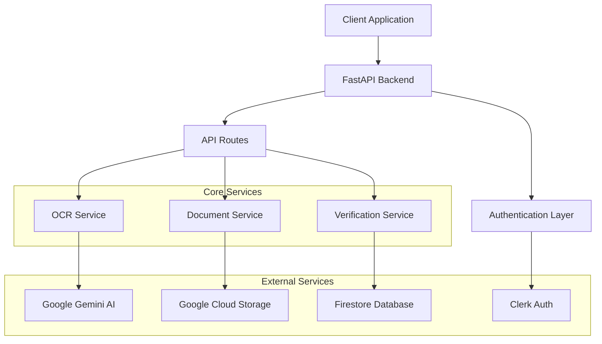
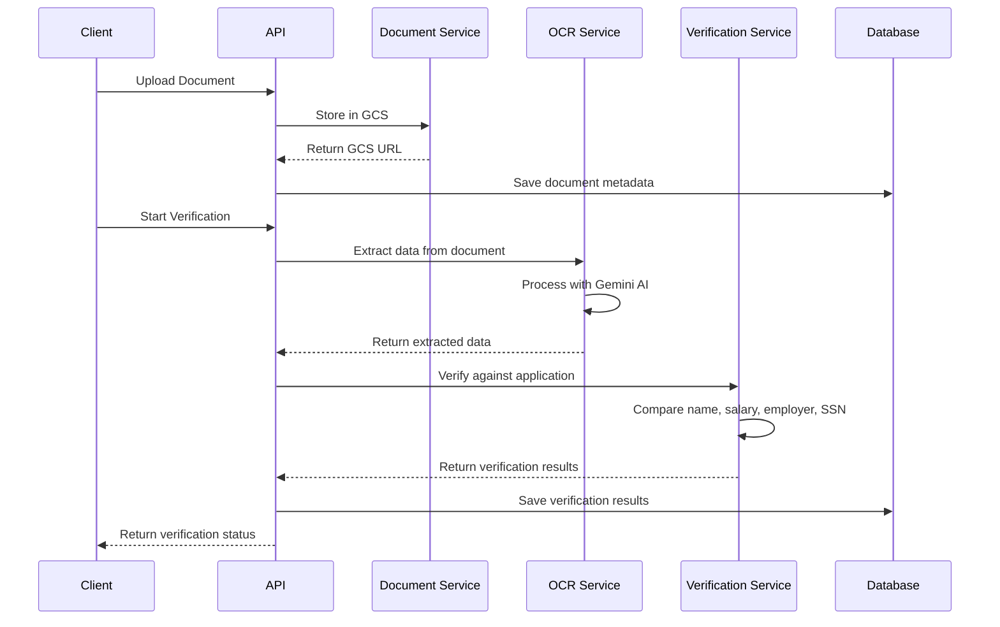
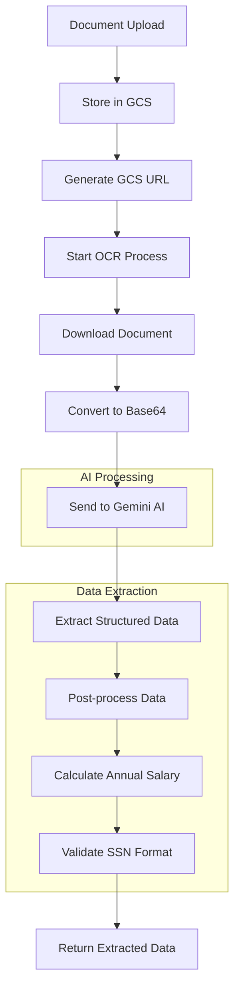

# 🔍 OCR Loan Verification API

A powerful FastAPI-based backend service that automates loan application verification using advanced OCR technology and AI. The system extracts and validates financial documents (pay stubs, income statements) to verify applicant information against loan applications, providing real-time fraud prevention and automated document processing.

## ✨ Key Features

- 🔍 **Smart OCR Processing** - Uses Google Gemini AI for accurate document text extraction
- 📊 **Automated Verification** - Compares extracted data with loan applications (name, salary, employer, SSN)
- 🔐 **Secure Authentication** - JWT-based auth with Clerk integration
- ☁️ **Cloud Storage** - Google Cloud Storage for document management
- 📈 **Real-time Analytics** - Statistics and verification tracking
- 🚀 **Live Verification** - Real-time streaming verification process
- 🐳 **Docker Ready** - Containerized deployment with health checks
- 📱 **RESTful API** - Clean, well-documented API endpoints

## 🏗️ Architecture



## 🔄 Verification Flow



## 📋 API Endpoints

### Authentication
- `POST /api/auth/verify-token` - Verify JWT token
- `GET /api/auth/me` - Get current user info

### Applications
- `POST /api/applications/` - Create loan application
- `GET /api/applications/` - Get user's applications
- `GET /api/applications/{id}` - Get specific application
- `PUT /api/applications/{id}` - Update application
- `DELETE /api/applications/{id}` - Delete application

### Documents
- `POST /api/documents/upload` - Upload document
- `GET /api/documents/` - Get user's documents
- `GET /api/documents/{id}` - Get specific document
- `DELETE /api/documents/{id}` - Delete document

### Verification
- `GET /api/verification/application/{id}` - Get verification results
- `GET /api/verification/application/{id}/latest` - Get latest verification
- `GET /api/verification/application/{id}/status` - Get verification status
- `GET /api/verification/application/{id}/live-verify` - Live verification stream

### Statistics
- `GET /api/stats/overview` - Get verification statistics
- `GET /api/stats/verification-trends` - Get verification trends

## 🚀 Quick Start

### Prerequisites

- Python 3.11+
- Google Cloud Platform account
- Clerk account for authentication
- Google Gemini API key

### Installation

1. **Clone the repository**
```bash
git clone https://github.com/adityasingh9699/Loan-Verification-OCR---API.git
cd OCR-Solution/backend
```

2. **Install dependencies**
```bash
pip install -r requirements.txt
```

3. **Set up environment variables**
```bash
cp env.example .env
```

4. **Configure environment variables**
```env
# Clerk Authentication
CLERK_SECRET_KEY=your_clerk_secret_key
CLERK_PUBLISHABLE_KEY=your_clerk_publishable_key

# Google Cloud Platform
GOOGLE_APPLICATION_CREDENTIALS=path/to/service-account-key.json
GCP_BUCKET_NAME=your-bucket-name
GCP_PROJECT_ID=your-project-id

# Gemini AI
GEMINI_API_KEY=your_gemini_api_key

# Application
DEBUG=false
```

5. **Run the application**
```bash
python main.py
```

The API will be available at `http://localhost:8000`

### Docker Deployment

1. **Build the image**
```bash
docker build -t ocr-loan-verification .
```

2. **Run the container**
```bash
docker run -p 8000:8000 --env-file .env ocr-loan-verification
```

## 🔧 Configuration

### Environment Variables

| Variable | Description | Required |
|----------|-------------|----------|
| `CLERK_SECRET_KEY` | Clerk authentication secret key | Yes |
| `CLERK_PUBLISHABLE_KEY` | Clerk publishable key | Yes |
| `GOOGLE_APPLICATION_CREDENTIALS` | Path to GCP service account key | Yes |
| `GCP_BUCKET_NAME` | Google Cloud Storage bucket name | Yes |
| `GCP_PROJECT_ID` | Google Cloud Project ID | Yes |
| `GEMINI_API_KEY` | Google Gemini API key | Yes |
| `DEBUG` | Enable debug mode | No |
| `CORS_ORIGINS` | Allowed CORS origins (comma-separated) | No |

### Service Account Setup

1. Create a Google Cloud service account
2. Download the JSON key file
3. Set the `GOOGLE_APPLICATION_CREDENTIALS` environment variable
4. Ensure the service account has the following roles:
   - Cloud Storage Admin
   - Firestore User
   - AI Platform User

## 📊 Data Models

### Loan Application
```json
{
  "id": "string",
  "user_id": "string",
  "name": "string",
  "annual_salary": "number",
  "employer_name": "string",
  "ssn": "string",
  "created_at": "datetime",
  "updated_at": "datetime"
}
```

### Verification Result
```json
{
  "id": "string",
  "application_id": "string",
  "document_id": "string",
  "extracted_data": "object",
  "name_match": "boolean",
  "name_reason": "string",
  "salary_match": "boolean",
  "salary_reason": "string",
  "extracted_salary": "number",
  "employer_match": "boolean",
  "employer_reason": "string",
  "extracted_employer": "string",
  "ssn_match": "boolean",
  "ssn_reason": "string",
  "extracted_ssn": "string",
  "overall_status": "string",
  "created_at": "datetime",
  "updated_at": "datetime"
}
```

## 🔍 OCR Processing Flow



## 🛡️ Security Features

- **JWT Authentication** - Secure token-based authentication
- **CORS Protection** - Configurable cross-origin resource sharing
- **Input Validation** - Pydantic models for request validation
- **Error Handling** - Comprehensive error handling and logging
- **Rate Limiting** - Built-in rate limiting capabilities
- **Data Encryption** - Secure data storage and transmission

## 📈 Monitoring & Analytics

The API provides comprehensive statistics and monitoring:

- **Verification Success Rate** - Track verification accuracy
- **Processing Times** - Monitor OCR processing performance
- **Error Rates** - Track and analyze failures
- **User Activity** - Monitor user engagement
- **Document Types** - Track processed document types

## 🧪 Testing

```bash
# Run tests
pytest

# Run with coverage
pytest --cov=app

# Run specific test file
pytest tests/test_verification.py
```

## 📚 API Documentation

Once the server is running, visit:
- **Swagger UI**: `http://localhost:8000/docs`
- **ReDoc**: `http://localhost:8000/redoc`

## 🤝 Contributing

1. Fork the repository
2. Create a feature branch (`git checkout -b feature/amazing-feature`)
3. Commit your changes (`git commit -m 'Add some amazing feature'`)
4. Push to the branch (`git push origin feature/amazing-feature`)
5. Open a Pull Request

## 📄 License

This project is licensed under the MIT License - see the [LICENSE](LICENSE) file for details.

## 🆘 Support

For support, email support@example.com or create an issue in the repository.

## 🔗 Related Projects

- [Frontend Application](../frontend) - React-based frontend application
- [Mobile App](../mobile) - React Native mobile application

---

**Built with ❤️ for the fintech industry**
